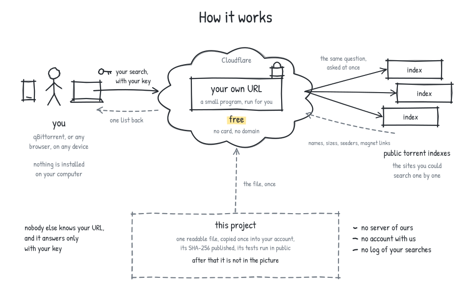

# Unified Torrent Search Interface

Search several public torrent indexes at once, from a URL only you know.

One small program, run for free by Cloudflare, asks the indexes your question
and merges the answers into one list: names, sizes, seeders, and `magnet:`
links. You get a URL and a key. Nothing is installed on your computer, no card
is involved, and there is no public copy of this. The only URL that exists is
the one you make.



## Get your URL and key

Free, about three minutes, and it works on a phone. You need a free Cloudflare
account, which is an email address and a password.

[](https://momzv2022-ctrl.github.io/unified-torrent-search-interface/)

The setup page takes you through four steps, one at a time: sign in to
Cloudflare, press Deploy, open your new Worker and press Finish setup, and your
URL and key are shown together, with a button that tests them. Never done
anything like this? [Watch someone do it](https://www.youtube.com/watch?v=CqjcpfIk1Rs), three
minutes.

Your key is made in your browser and never sent anywhere, and the page itself
makes no network request. If you would rather check the file before you deploy
it, [everything you need is below](#check-it-before-you-trust-it).

<details>
<summary>If you have a terminal</summary>

```sh
curl -fsSLO https://momzv2022-ctrl.github.io/unified-torrent-search-interface/worker.js
KEY=$(openssl rand -hex 16)
npx wrangler deploy worker.js --name utsi-$(openssl rand -hex 3) \
  --compatibility-date 2026-08-18 --var UTSI_API_KEY:"$KEY"
echo "your key: $KEY"
```

`wrangler` opens your browser once to sign in to Cloudflare, then prints your
URL. The file is deployed unedited, with the key as a variable, so what runs is
exactly what
[`worker.js.sha256`](https://momzv2022-ctrl.github.io/unified-torrent-search-interface/worker.js.sha256)
covers. Prefer a secret? Drop the `--var` and run
`wrangler secret put UTSI_API_KEY` afterwards.

</details>

## Use it in qBittorrent

qBittorrent has a search tab that takes plugins.
[`qbittorrent/utsi.py`](qbittorrent/utsi.py) sends your searches to your URL.

1. On the setup page, in step 4, press **Download the qBittorrent plugin**. The
   file comes with your URL and key already inside. If you would rather do it
   by hand, fill in the two lines at the top of the file.
2. In qBittorrent, open *View* and tick *Search Engine*. If it offers to
   install Python, accept.
3. In the Search tab, press *Search plugins*, then *Install a new one*, then
   *Local file*, and choose `utsi.py`.
4. Search. Results come from your URL.

The file has your key in it. Do not share it.

### Use it from anything else

The URL is an ordinary JSON API: three routes, one header.

```sh
curl -H "X-API-Key: YOUR-KEY" \
  "https://your-url.workers.dev/api/v1/search?q=big+buck+bunny&limit=5"
```

`/api/v1/search` takes `q`, and optionally `cat`, `limit`, `offset`, `sort` and
`min_seeders`. `/api/v1/engines` lists the indexes. `/healthz` needs no key and
says which indexes are answering. Every field is in [docs/api.md](docs/api.md).

## Run it on your own machine instead

The Cloudflare version searches a handful of indexes with a real API, plus one
meta-index that covers dozens of trackers. The version below searches around a
hundred sites, by running qBittorrent's own search plugins in a sandbox. It
needs **Python 3.11 or newer** and a Mac, a Linux box, or Windows with WSL.

```sh
git clone https://github.com/momzv2022-ctrl/unified-torrent-search-interface
cd unified-torrent-search-interface
./start.sh
```

The first run takes a few minutes. When it finishes it prints a URL and a key:

```
  URL  https://calm-mode-tiny-fox.trycloudflare.com
  Key  Xy9wR2mKp4Ln8vQ2sT6yB1cE5hJ9dF3g
```

Open the URL in any browser, paste the key in once, and search. `./stop.sh`
takes it down and `./update.sh` gets the latest version. The plugins are
downloaded fresh every start and each one runs inside its own locked box. No
plugin code lives in this repository, and the reasons are in
[docs/security.md](docs/security.md).

You can also point a Cloudflare Worker at a machine running `./start.sh`, and
get the hundred plugins behind a URL that stays up when the machine sleeps. Set
`UTSI_UPSTREAM_URL` on the Worker, as described in
[docs/cloudflare.md](docs/cloudflare.md#your-own-index). Windows, a cheap
server, and what to do when few engines answer are in
[docs/development.md](docs/development.md).

## Check it before you trust it

A stranger is asking you to put their code into your cloud account. Being
suspicious of that is correct, and everything below can be done before you
deploy anything.

- **It is one file, and you can read all of it.**
  [`worker/src/worker.js`](worker/src/worker.js), no dependencies, no build
  step, no minifier. What you deploy is what you read.
- **The published file is this file.** A public GitHub Actions run copies it
  to the setup page and prints its SHA-256, which the page shows and
  [`worker.js.sha256`](https://momzv2022-ctrl.github.io/unified-torrent-search-interface/worker.js.sha256)
  publishes. Download it and run `shasum -a 256 worker.js`.
- **Search the file for `fetch(`.** Every request goes to a torrent index in
  the engine list, or to this project's own version and feed files on GitHub
  Pages. No other host, no telemetry.
- **Your key never leaves your browser.** The setup page makes it with
  `crypto.getRandomValues` and writes it into the copy of the file inside the
  deploy link, after the `#`, which browsers do not send to servers. The page
  makes no network request. Open your browser's network tab and watch.
- **It can only answer requests sent to its own URL**, with your key. It has
  no access to your computer, your files, or anything else in your Cloudflare
  account.
- **You can delete it in one click.** In Cloudflare, open *Workers & Pages*,
  your Worker, *Settings*, *Delete*. The URL stops answering at once.

The tests run offline against recorded answers, on every push, for both the
Worker and the local server. The setup page is opened in a real browser at
five screen sizes, and the run fails if it ever makes a network request.

## What it does not do

It **searches public indexes and returns names, sizes, swarm counts and
`magnet:` links**. It hosts nothing, stores nothing, transfers no file, and
downloads nothing. The links open in whatever torrent app you already have.
qBittorrent ships the same kind of search plugins; Jackett and Prowlarr are the
same kind of tool.

Public indexes move domain, rate limit, and go down. `/healthz` needs no key
and says which ones are answering and what broke. How to read it, and how to
point an engine at a new domain without redeploying, is in
[docs/cloudflare.md](docs/cloudflare.md).

## Privacy

It **keeps no search log**, and on the Cloudflare path request logging is
switched off in the file on purpose. That is a statement about logging and
nothing more. It is not anonymity: the indexes see the query, your network
carries it, and on the Cloudflare path Cloudflare is your network.

There is **no public instance of this and no list of other people's**. Nobody
is given your URL but you, and it needs your key before it answers anything.

## Your responsibility

Laws about what you may download differ from country to country, and so do the
terms of the sites this queries. Complying with both is yours to do. Plenty of
what moves over BitTorrent is meant to: Linux and BSD images, Internet Archive
material, public domain film, Creative Commons music and video, and large open
datasets. The examples throughout this project are *Big Buck Bunny* and
*Sintel*, both released by the Blender Foundation under Creative Commons, and
*Ubuntu*, and that is deliberate. Nothing here is legal advice.

## Going deeper

| | |
|---|---|
| [docs/api.md](docs/api.md) | The API in full, and how plugin output becomes it |
| [docs/cloudflare.md](docs/cloudflare.md) | The Worker: settings, engines, limits, trade-offs |
| [docs/deploy-link.md](docs/deploy-link.md) | How the setup flow was arrived at, and what is still unverified |
| [docs/tgp.md](docs/tgp.md) | The signed engine feed: how a deployed Worker stays current |
| [docs/security.md](docs/security.md) | The sandbox, the plugin registry, the nightly bot |
| [docs/development.md](docs/development.md) | Tests, layout, contributing |
| [PLUGINS.md](PLUGINS.md) | Every plugin the local server can run, its author and its licence |
| [.env.example](.env.example) | Every setting, with defaults |

```
worker/src/worker.js     the Cloudflare Worker, one file, no dependencies
qbittorrent/utsi.py      the qBittorrent search plugin
src/utsi/                the local server: plugin sandbox, fan-out, API
registry.json            the plugin list, refreshed nightly and pinned
```

## Licence

MIT, with no warranty of any kind. It covers the code in this repository only.
There is no plugin code here: the plugins the local server fetches stay under
their own licences, listed in [PLUGINS.md](PLUGINS.md), and the nova3 runtime
files are distributed by their authors under a 3-clause BSD-style licence.
